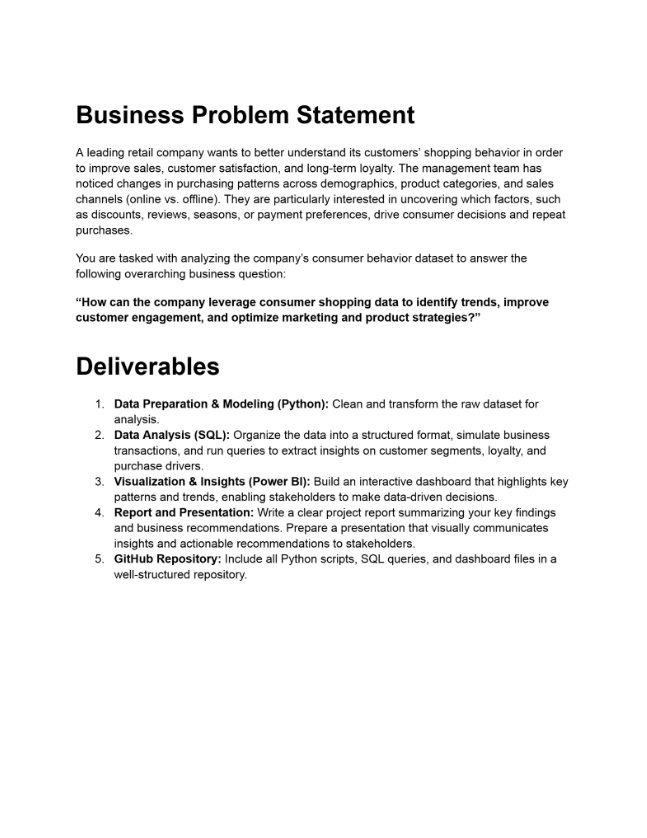
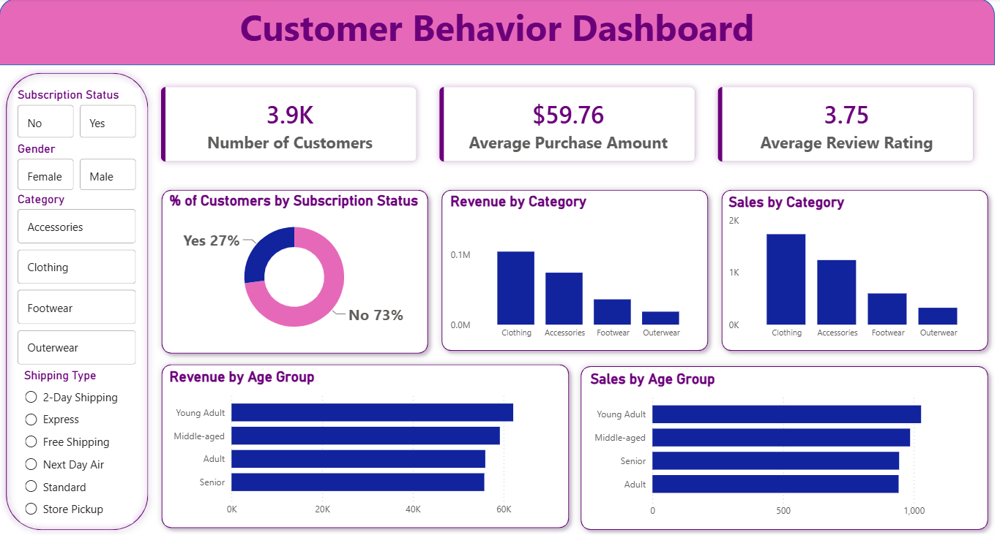

# Customer-Behavior-Analysis
An end-to-end Data Analytics project using Python, PostgreSQL, SQL and Power BI.

## 📸 Dashboard Preview


---

# 🖼️ Business Problem

The project was developed around a retail customer behavior business problem.


## 📌 Project Overview

**Customer Behavior Analysis** is an end-to-end **Data Analytics project** focused on analyzing customer shopping behavior to identify purchasing patterns, customer preferences, product trends, and factors influencing consumer decisions.

The project follows a complete data analytics workflow using **Python, PostgreSQL/SQL, and Power BI**, starting from raw customer shopping data and progressing through data cleaning, exploratory data analysis, SQL-based business analysis, interactive dashboard development, reporting, and presentation.

The goal is to transform raw customer data into meaningful business insights that can support **customer engagement, marketing strategies, product decisions, and data-driven decision-making**.

---

## 🎯 Business Problem Statement

A leading retail company wants to better understand its customers’ shopping behavior in order to improve sales, customer satisfaction, and long-term customer loyalty.

The management team has noticed changes in purchasing patterns across demographics, product categories, and sales channels. They are particularly interested in understanding which factors, such as **discounts, reviews, seasons, and payment preferences**, influence consumer decisions and repeat purchases.

### Business Question

> **How can the company leverage consumer shopping data to identify trends, improve customer engagement, and optimize marketing and product strategies?**



---

# 🎯 Project Objectives

The main objectives of this project are:

* Analyze customer shopping behavior and purchasing patterns.
* Identify trends across customer demographics.
* Analyze product category performance.
* Understand the impact of discounts on purchasing behavior.
* Examine customer reviews and ratings.
* Analyze customer payment method preferences.
* Study purchase frequency and customer loyalty.
* Identify factors influencing customer purchasing decisions.
* Perform business analysis using SQL.
* Build an interactive Power BI dashboard.
* Generate actionable business insights and recommendations.

---

# 🛠️ Technologies & Tools Used

| Technology / Tool           | Purpose                                                |
| --------------------------- | ------------------------------------------------------ |
| 🐍 **Python**               | Data cleaning, transformation and exploratory analysis |
| 🐼 **Pandas**               | Data manipulation and analysis                         |
| 🔢 **NumPy**                | Numerical operations                                   |
| 📓 **Jupyter Notebook**     | Python-based data analysis                             |
| 🐘 **PostgreSQL**           | Database management                                    |
| 💾 **SQL**                  | Business analysis and insight extraction               |
| 📊 **Power BI**             | Interactive dashboard and visualization                |
| 📈 **Matplotlib / Seaborn** | Data visualization                                     |
| 📝 **PowerPoint / Gamma**   | Project presentation                                   |
| 🐙 **Git & GitHub**         | Version control and project showcase                   |

---

# 🔄 Project Workflow

```text
Raw Customer Shopping Dataset
            ↓
     Data Loading
        (Python)
            ↓
   Data Cleaning &
    Transformation
            ↓
Exploratory Data Analysis
        (Python)
            ↓
    PostgreSQL Database
            ↓
      SQL Analysis
            ↓
    Business Insights
            ↓
    Power BI Dashboard
            ↓
  Report & Presentation
```

---

# 1. 📥 Data Preparation & Modeling — Python

The raw customer shopping behavior dataset was loaded and prepared using Python.

### Key activities:

* Loaded the dataset using Pandas.
* Inspected the dataset structure.
* Checked rows and columns.
* Reviewed data types.
* Identified missing values.
* Checked duplicate records.
* Examined categorical and numerical variables.
* Cleaned and transformed the data.
* Prepared the dataset for SQL analysis and visualization.

### Python Libraries Used

```text
pandas
numpy
matplotlib
seaborn
```

### Analysis File

The complete Python analysis is available in:

**`Customer_Shopping_Behavior_Analysis.ipynb`**

---

# 2. 🔎 Exploratory Data Analysis

Exploratory Data Analysis (EDA) was performed to understand the characteristics and patterns within the customer shopping dataset.

### Areas analyzed:

* Customer demographics
* Age distribution
* Gender distribution
* Product categories
* Purchase amounts
* Review ratings
* Discount usage
* Payment methods
* Purchase frequency
* Customer purchasing patterns

EDA helped identify important patterns and relationships before performing SQL-based business analysis.

---

# 3. 🗄️ SQL Data Analysis — PostgreSQL

The prepared customer shopping data was loaded into **PostgreSQL** for structured business analysis.

SQL queries were developed to answer business-oriented questions related to customer behavior, purchasing patterns, product performance, discounts, and customer loyalty.

### SQL Analysis Includes

* Customer segmentation
* Customer purchasing behavior
* Product category analysis
* Purchase analysis
* Customer loyalty analysis
* Discount usage
* Payment method preferences
* Review and rating analysis
* Purchase frequency
* Customer-level analysis
* Business performance analysis

### SQL Concepts Used

```text
SELECT
WHERE
GROUP BY
ORDER BY
HAVING
CASE WHEN
COUNT()
SUM()
AVG()
MIN()
MAX()
JOINs
Subqueries
CTEs
Aggregate Functions
```

### SQL File

All SQL queries are available in:

**`customer_behavior_queries.sql`**

---

# 4. 📊 Power BI Dashboard

An interactive **Power BI dashboard** was developed to visualize important customer behavior patterns and business insights.

The dashboard allows stakeholders to explore customer behavior using interactive visualizations and filters.

### Dashboard Analysis Includes

* Customer demographics
* Purchase behavior
* Product categories
* Sales performance
* Discounts
* Customer reviews
* Payment methods
* Purchase frequency
* Customer loyalty
* Key customer trends

### Dashboard Features

* KPI cards
* Interactive charts
* Filters and slicers
* Category analysis
* Customer analysis
* Trend analysis
* Business-focused visualizations

### Power BI File

The complete Power BI dashboard is available in:

**`customer_behavior_dashboard.pbix`**

### Dashboard Preview



---

# 5. 💡 Business Insights

The analysis focuses on identifying meaningful patterns in customer shopping behavior.

### Customer Behavior

Understanding how customers from different demographic groups interact with products and make purchases.

### Product Categories

Analyzing purchasing patterns across different product categories to understand product-level performance.

### Discounts

Examining the relationship between discount availability and customer purchasing behavior.

### Reviews & Ratings

Analyzing customer review and rating patterns to understand customer feedback and satisfaction indicators.

### Payment Methods

Understanding customer preferences across different payment methods.

### Purchase Frequency

Analyzing how frequently customers make purchases and identifying patterns related to customer loyalty.

### Customer Segments

Comparing shopping behavior across different customer groups to support targeted marketing strategies.

---

# 6. 📈 Business Recommendations

The analysis can help businesses:

* Develop targeted marketing campaigns.
* Improve customer engagement strategies.
* Identify important customer segments.
* Optimize product-level marketing strategies.
* Improve promotional campaigns.
* Understand discount-related purchasing patterns.
* Develop customer retention strategies.
* Use customer feedback to support product decisions.
* Optimize payment options according to customer preferences.
* Support data-driven business decisions.

---

# 7. 📁 Project Files

All project files are maintained directly in the main GitHub repository.

| File                                            | Description                            |
| ----------------------------------------------- | -------------------------------------- |
| `customer_shopping_behavior.csv`                | Raw customer shopping behavior dataset |
| `Customer_Shopping_Behavior_Analysis.ipynb`     | Python data cleaning, EDA and analysis |
| `customer_behavior_queries.sql`                 | SQL business analysis queries          |
| `customer_behavior_dashboard.pbix`              | Power BI interactive dashboard         |
| `dashboard.png`                                 | Power BI dashboard preview             |
| `business_problem.png`                          | Business problem statement             |
| `Customer_Behavior_Analytics_Report.pdf`        | Detailed project report                |
| `Customer_Behavior_Analytics_Presentation.pptx` | Project presentation                   |
| `README.md`                                     | Project documentation                  |

---

# 8. 📋 Project Deliverables

The project contains the following major deliverables:

### 1. Data Preparation & Modeling

Cleaned and transformed the raw customer shopping behavior dataset using Python.

### 2. Exploratory Data Analysis

Performed exploratory analysis to identify customer behavior patterns and trends.

### 3. SQL Business Analysis

Used PostgreSQL and SQL queries to extract business-oriented insights.

### 4. Power BI Dashboard

Created an interactive dashboard to visualize important KPIs, trends, and customer behavior.

### 5. Project Report

Created a detailed report documenting the project methodology, analysis, findings, and recommendations.

### 6. Project Presentation

Created a presentation summarizing the project, analysis, insights, and recommendations.

---

# 9. 🔍 End-to-End Analytics Process

## Step 1 — Understand the Business Problem

Defined the business problem and identified the key questions that needed to be answered using customer shopping data.

## Step 2 — Load the Dataset

Loaded the raw customer shopping behavior dataset into Python using Pandas.

## Step 3 — Data Cleaning

Performed data preparation activities including:

* Missing value checking
* Duplicate checking
* Data type validation
* Data consistency checking
* Data transformation

## Step 4 — Exploratory Data Analysis

Performed EDA using Python to understand customer demographics, purchasing behavior, products, discounts, reviews, payment methods, and purchase frequency.

## Step 5 — PostgreSQL Database

Loaded the prepared dataset into PostgreSQL for structured analysis.

## Step 6 — SQL Business Analysis

Created SQL queries to answer business questions and extract meaningful insights.

## Step 7 — Power BI Dashboard

Built an interactive dashboard to communicate important findings visually.

## Step 8 — Business Insights

Interpreted the analytical results and identified potential business opportunities.

## Step 9 — Report & Presentation

Documented the complete project and prepared a presentation for communicating the findings.

---

# 10. 📊 Project Dashboard

The Power BI dashboard provides a visual overview of customer shopping behavior.


The dashboard can be explored using the Power BI file:

**`customer_behavior_dashboard.pbix`**

---

# 11. 📚 Skills Demonstrated

This project demonstrates practical experience in:

### Data Analytics

* Data Cleaning
* Data Preprocessing
* Exploratory Data Analysis
* Customer Analytics
* Business Analysis

### Python

* Python
* Pandas
* NumPy
* Matplotlib
* Seaborn
* Jupyter Notebook

### SQL & Database

* SQL
* PostgreSQL
* Data querying
* Aggregations
* Joins
* CTEs
* Subqueries
* Business-oriented SQL analysis

### Business Intelligence

* Power BI
* Dashboard Development
* Data Visualization
* KPI Analysis
* Interactive Reporting

### Professional Skills

* Business Problem Solving
* Data Storytelling
* Insight Generation
* Business Recommendations
* Report Writing
* Presentation
* Git & GitHub

---

# 12. 🎓 Learning Outcomes

Through this project, I gained practical experience in the complete data analytics lifecycle.

### Key learning outcomes:

* Working with customer shopping behavior data.
* Cleaning and preparing raw datasets.
* Performing exploratory data analysis using Python.
* Writing SQL queries to solve business problems.
* Working with PostgreSQL.
* Building interactive Power BI dashboards.
* Converting analytical results into business insights.
* Developing business recommendations.
* Creating professional project documentation.
* Presenting analytical findings to stakeholders.
* Showcasing an end-to-end analytics project using GitHub.

---

# 13. 🚀 Future Enhancements

The project can be further enhanced by:

* Advanced customer segmentation.
* Customer Lifetime Value (CLV) analysis.
* Customer churn prediction.
* Purchase prediction models.
* Advanced statistical analysis.
* Machine learning-based customer behavior prediction.
* Automated dashboard refresh.
* Cloud database integration.
* Advanced Power BI measures and KPIs.

---

# 14. 📄 Project Documentation

### 📑 Detailed Report

The complete project report is available here:

**`Customer_Behavior_Analytics_Report.pdf`**

### 📊 Project Presentation

The project presentation is available here:

**`Customer_Behavior_Analytics_Presentation.pptx`**

---

# 15. 💻 How to Run the Python Analysis

## Requirements

Install the required Python libraries:

```bash
pip install pandas numpy matplotlib seaborn jupyter
```

## Start Jupyter Notebook

```bash
jupyter notebook
```

Then open:

```text
Customer_Shopping_Behavior_Analysis.ipynb
```

---

# 16. 🗄️ PostgreSQL Setup

The SQL analysis was performed using PostgreSQL.

The SQL queries are available in:

```text
customer_behavior_queries.sql
```

The queries can be executed in **pgAdmin / PostgreSQL** after loading the customer shopping behavior dataset into the database.

---

# 17. 📌 Repository Structure

The repository intentionally keeps all project files directly in the main repository.

```text
Customer-Behavior-Analysis/
│
├── Customer_Behavior_Analytics_Presentation.pptx
├── Customer_Behavior_Analytics_Report.pdf
├── Customer_Shopping_Behavior_Analysis.ipynb
├── README.md
├── business_problem.png
├── customer_behavior_dashboard.pbix
├── customer_behavior_queries.sql
├── customer_shopping_behavior.csv
└── dashboard.png
```

---

# 18. 👩‍💻 Author

## Sai Suryawanshi

**MCA Graduate | Aspiring Data Analyst**

### Technical Skills

**Programming & Data Analysis:**
Python, SQL, Pandas, NumPy

**Database:**
PostgreSQL, MySQL, SQLite

**Visualization & Business Intelligence:**
Power BI, Matplotlib, Seaborn

**Tools:**
Jupyter Notebook, Git, GitHub, Excel, Google Sheets

---

# ⭐ Project Summary

**Customer Behavior Analysis** is an end-to-end Data Analytics project demonstrating how raw customer shopping data can be transformed into actionable business insights.

The project covers:

**Python → Data Cleaning → EDA → PostgreSQL → SQL Analysis → Power BI → Business Insights → Report → Presentation**

The project demonstrates practical skills in **Python, SQL, PostgreSQL, Power BI, data visualization, business analysis, and data storytelling**.

---

## 🔗 Repository

**GitHub Repository:**
`Customer-Behavior-Analysis`

All project files, including the dataset, Python notebook, SQL queries, Power BI dashboard, dashboard preview, business problem statement, project report, and presentation are available in this repository.
